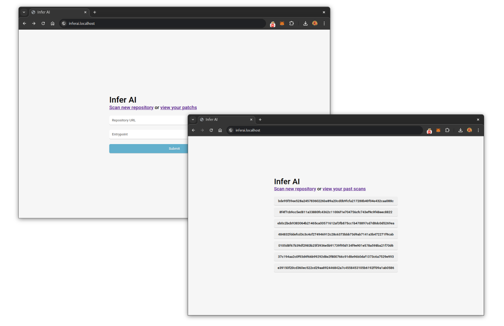
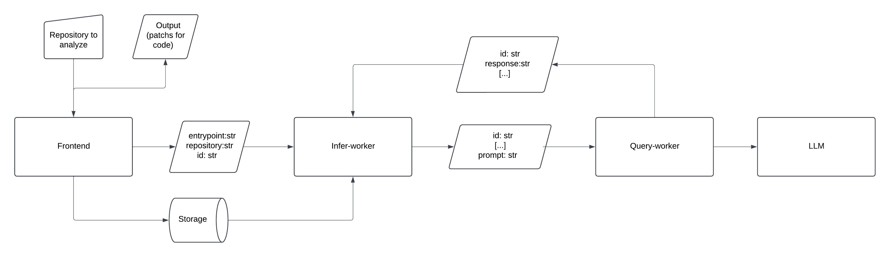

# InferAI



**InferAI** is an experiment tool designed to automatically generate patches for security vulnerabilities identified by the [Infer Static Analyzer](https://github.com/facebook/infer) through the use of LLMs. This project was developed as part of the Ingegneria dei Sistemi Distribuiti course at the University of Catania (UNICT), with the goal of bridging the gap between vulnerability detection and resolution.

The project is intended as a conceptual tool to explore automation in vulnerability patching. While it provides insights into the potential of such tools, InferAI is not designed for production use or highly complex projects.

## Code Structure and Workflow



The software is divided into three parts to work asynchronously:

1. **Frontend**:
   - A basic web interface that enables users to start jobs and view results.
   
2. **Infer-Worker**:
   - A backend service responsible for running Infer Static Analyzer and parsing the code and enrich it.

3. **Query-Worker**:
   - A backend service that queries the LLM to generate patch suggestions based on the output of Infer.

The three components communicate asynchronously through message queues provided by **RabbitMQ**.

The workflow is as follows:

1. **Job Creation**:
A user initiates a job through the frontend. The job is defined by an ID, the repository link to analyze, and the code entry point. This information is sent to the Infer-worker via the analyze-jobs queue.

2. **Code Analysis**:
Infer-worker processes the job by analyzing the code with the Infer Static Analyzer. Vulnerabilities are grouped by functions, and the code is enriched with contextual comments for the LLM (as illustrated below). The library used for source code manipulation is Tree-sitter. Each vulnerable function is sent to the Query-worker through the query-jobs queue.

3. **Code fix generation**:
Query-worker processes incoming messages and manages rate limit errors. The LLM response generates a patched version of the vulnerable function, which is forwarded to the patch-jobs queue, handled by the Infer-worker.

4. **Patch Generation**:
Infer-worker compares the patched function generated by the LLM with the original function to create an applicable patch file. Infer Static Analyzer is run again to verify the quality of the generated code, though retry handling is not currently implemented.

5. **Result Retrieval**:
Users can download the processed results through the frontend.

> [!NOTE] 
> This setup is a proof of concept and has areas for improvement. For instance:
> The shared storage between the frontend and Infer-worker could be replaced with cloud storage.
> A database could be introduced to track users and their jobs more effectively.
> Currently, the frontend manages user sessions and analyzed files with a simple JWT token.

## Installation

To set up and run InferAI, follow these steps:

```bash
git clone https://github.com/v0lp3/InferAI.git
```

Set the required tokens:

```bash
cd InferAI
mkdir secrets
cd secrets
echo "YOUR_GROQ_TOKEN" > groq_token.txt
echo "RANDOM_PASSWORD" > rabbitmq.txt
echo "RANDOM_PASSWORD2" > flask.txt # optional
```

Run with docker:

```bash
docker compose up
```

## Example

> [!NOTE]  
> Different execution can produce different results.

Given the following code as input:

```c
#include <string.h>

int main () {

        char* test = malloc(-1);
        strcpy(test, "yoooooooo");

}
```

Infer will produce the following report:

```
main.c:6: error: Buffer Overrun L1
  Offset: 9 Size: [0, -1].
  4.
  5.         char* test = malloc(-1);
  6.         strcpy(test, "yoooooooo");
             ^
  7.
  8. }

main.c:5: error: Inferbo Alloc Is Big
  Length: 18446744073709551615.
  3. int main () {
  4.
  5.         char* test = malloc(-1);
                          ^
  6.         strcpy(test, "yoooooooo");
  7.

main.c:6: error: Null Dereference
  pointer `test` last assigned on line 5 could be null and is dereferenced by call to `strcpy()` at line 6, column 9.
  4.
  5.         char* test = malloc(-1);
  6.         strcpy(test, "yoooooooo");
             ^
  7.
  8. }


Found 3 issues
                  Issue Type(ISSUED_TYPE_ID): #
          Null Dereference(NULL_DEREFERENCE): 1
  Inferbo Alloc Is Big(INFERBO_ALLOC_IS_BIG): 1
        Buffer Overrun L1(BUFFER_OVERRUN_L1): 1
```

InferAI processes the report from Infer Static Analyzer and enriches the original code by adding contextual comments directly below the detected vulnerabilities. For instance:

```c
#include <string.h>

int main () {
        // [Unsafe] INFERBO_ALLOC_IS_BIG: Length: 18446744073709551615.
        char* test = malloc(-1);
        // [Unsafe] NULL_DEREFERENCE: pointer `test` last assigned on line 5 could be null and is dereferenced by call to `strcpy()` at line 6, column 9.
        // [Unsafe] BUFFER_OVERRUN_L1: Offset: 9 Size: [0, -1].
        strcpy(test, "yoooooooo");

}
```

The enriched code is then passed to the LLM, which uses the additional context to generate a patch.

```diff
--- test3/main.c
+++ test3/main.c
@@ -2,7 +2,11 @@
 
 int main () {
 
-        char* test = malloc(-1);
-        strcpy(test, "yoooooooo");
+        char* test = NULL;
+        if(test = malloc(256)) {
+                strcpy(test, "yoooooooo");
+                free(test);
+        }
 
 }
```

## Author

- [Andrea Maugeri](https://github.com/v0lp3)
